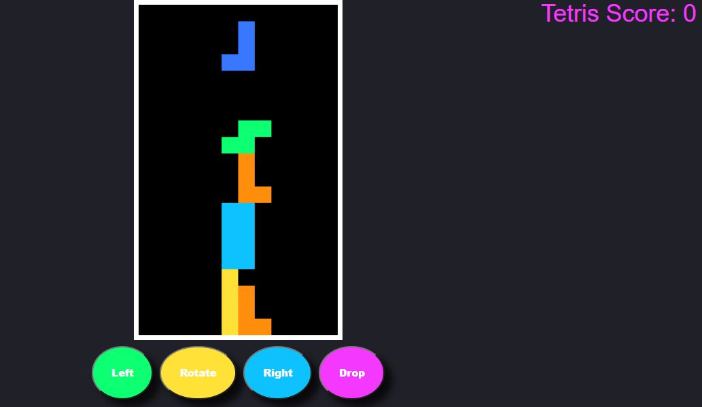

<h1>Classic Tetris </h1>

<h2>DESCRIPTION</h2>

Arcade style tetris using pure HTML, CSS, & JavaScript

Credit to a tutorial from Meth Meth Method <a href="https://www.youtube.com/watch?v=H2aW5V46khA">https://www.youtube.com/watch?v=H2aW5V46khA</a>

I've updated some deprecated code using keydown and converted to use buttons to add an event listener "click" to handle which will also make this mobile friendly. 

I also converted the score to a template literal

<h3>VIEW SITE:</h3>
<a href="https://elowskya.github.io/tetris/ ">https://elowskya.github.io/tetris/ </a>